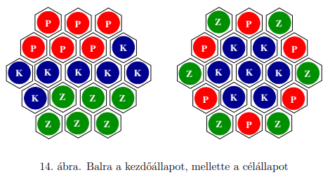
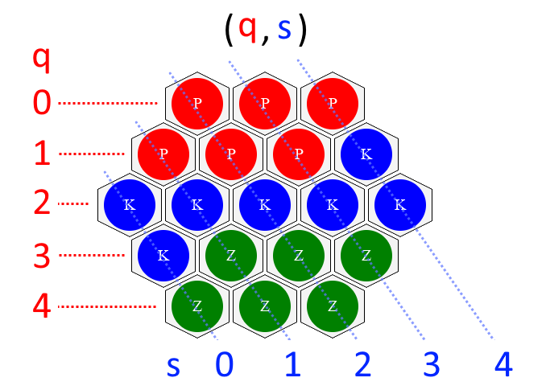

[](https://classroom.github.com/a/UkdUJk5L)

# SpinHex

Debreceni Egyetem, Informatikai Kar
Programtervező informatikus BSc, 2024/2025. tanév, 2. félév
Szoftverfejlesztés (INBPM0420E) – Házi feladat projekt

Készítette: Pataki Dávid Ferenc (JDS8WG)

Lényeges háttéranyag: [Teljesítmény Analízis](performance_analysis.md)

## Feladat

### Eredeti Leírás

> 1.16. Feladat
>
> Rendezzünk el 6 piros, 6 zöld és 7 kék korongot a 14. ábra bal oldalán látható módon.
>
> Válasszunk ki egy olyan korongot, amelynek 6 szomszédja van — ezek a szomszédok elforgathatók egy pozícióval balra vagy jobbra.
>
> Érjük el forgatásokkal, hogy a korongok a 14. ábra jobb oldalán látható módon helyezkedjenek el.



### Játék menete

- A kezdőképernyőn adja meg felhasználónevét
- Válassza ki a "Start Game" opciót
- A játéktáblán kattintson egy olyan korongra, amelynek 6 szomszédja van
- A megjelenő forgató gombok segítségével forgassa el a korongokat az óramutató járásával megegyező vagy ellentétes irányba
- A cél a jobb oldalon látható minta elérése a lehető legkevesebb lépésben

### Megoldás

- **(2,2)** pozícióból óramutató irányával **ellentétes** forgatás
- **(2,2)** pozícióból óramutató irányával **ellentétes** forgatás
- **(1,2)** pozícióból óramutató irányával **ellentétes** forgatás
- **(2,2)** pozícióból óramutató irányával **ellentétes** forgatás
- **(3,1)** pozícióból óramutató járásával **megegyező** forgatás
- **(2,1)** pozícióból óramutató járásával **megegyező** forgatás
- **(1,2)** pozícióból óramutató irányával **ellentétes** forgatás
- **(2,3)** pozícióból óramutató irányával **ellentétes** forgatás
- **(1,3)** pozícióból óramutató járásával **megegyező** forgatás

Index magyarázat:



## Telepítés és Futtatás

### Követelmények

- **Java 24** vagy újabb
- **Maven 3.9.9** vagy újabb

### Project klónozása

```bash
git clone https://github.com/INBPM0420L/homework-project-2025-GitDevla
cd SpinHex
```

### Maven Projekt Beállítása

1. Futtassa a Maven parancsot a függőségek letöltéséhez és a projekt felépítéséhez:

```bash
mvn clean package
```

2. Futtassa a projektet:

```bash
mvn exec:java
```

### Tesztelés

A projekt teszteléséhez használja a következő Maven parancsot:

```bash
mvn test
```

### Dokumentáció

Dokumentáció generálásához használja a következő Maven parancsot:

```bash
mvn site
```
