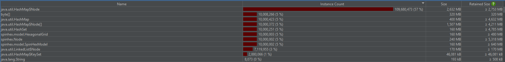
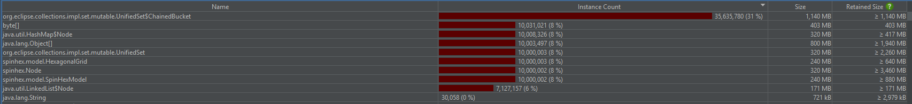
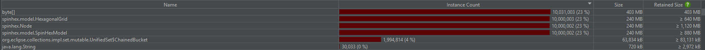
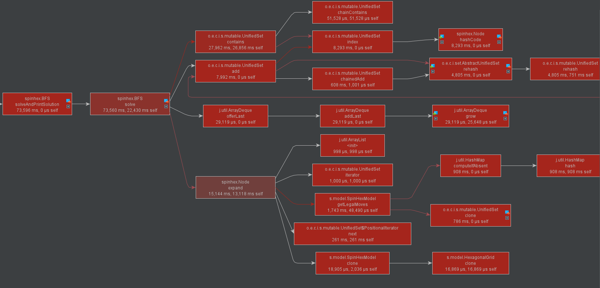

# Teljesítmény elemzés

## Állapottér-elemzés

- **Lépések állapotonként**: 14 (2 irány \* 7 pozíció)
- **Maximum különböző állapot elméleti határa**: A játéktábla 19 hexagonból áll (6 piros, 7 kék, 6 zöld), a sorrend számít, ismétlés engedett: <br> <br> (ezt a számot sajnos el is tudjuk érni a játék felépítése miatt ~10 lépésből)

## Model memória használata

### Jelenlegi implementáció

A modell a játékállapotot a HexagonalGrid segédosztályon keresztül tárolja. Az 5x5-ös rácsot egy 19 elemű egy dimenziós tömb reprezentálja, kihagyva a nem használt cellákat.

```
HexagonalGrid osztály:
16 byte  Object fejléc
  4 byte  byte[] board referencia
    16 byte Object fejléc
     4 byte hossz
    19 byte cellák
     1 byte padding
  1 byte SIZE
3 byte padding
Összesen: Shallow 24 byte, Retained: 64 byte
```

```
SpinHexModel osztály:
16 byte  Object fejléc
  4 byte HexagonalGrid board referencia (+64 byte)
  4 byte HexagonalGrid solvedBoard referencia (megosztott referencia BFS-ben)
Összesen: Shallow 24 byte, Retained: 88 byte
```

Állapottér teljes elméleti memóriahasználata:
46,558,512 \* 88 byte ~= 4.1GB
("kicsit" több mint a Dr. Jeszenszky Péter Tanár Úrnak kiszámolt 1.2 GB, azóta egy kicsit bővült a tudásom a Java memóriakezelésről)

### Alternatív implementáció

#### Segédosztály elhagyása

A HexagonalGrid elhagyásával kb. 16 byte-ot spórolhatunk állapotonként, így a memóriaigény kb. 3.3 GB-ra csökkenne.

> **Miért nem alkalmazom?**
>
> A SpinHexModel osztálynak túl sok felelősége lenne.

#### Bitmanipuláció (Bit Twiddling)

Egy 5×5-ös, 3 színes tábla 2 bit/szín kódolással egyetlen long (64 bit) típusban tárolható, azaz 38 bit elegendő. A segédosztállyal együtt az állapotméret ~48 byte, a teljes memóriahasználat ~2.2 GB.

> **Miért nem alkalmazom?**
>
> A módszer nem skálázható jól: például 7×7-es tábla vagy 9 szín esetén túllépjük a 64 bit korlátot. Ezek a kiterjesztések viszont a játék jövőbeli fejlesztésében reálisan felmerülhetnek.

## BFS teljesítmény elemzés

| Módszer                       | Memória használat | Futási idő |
| ----------------------------- | ----------------- | ---------- |
| Eredeti BFS                   | 22 GB             | 4:36       |
| Eredeti BFS (UnifiedSet)      | 14 GB             | 2:49       |
| Módosított BFS                | 7.2 GB            | 1:44       |
| Módosított BFS (optimalizált) | 5.1 GB            | 1:21       |

### Tesztelési környezet

- JProfiler v15.0.2 Trial (IntelliJ Profiler nem akart elindulni Java 24 alatt)
- Ryzen 5 7500F, 32 GB RAM
- Memória képek akkor készültek amikor a `seen` halmaz eléri a 10 millió elemet.

### Memória használat

Az alap BFS-implementáció jelentősen túllépi az elméleti 4.1 GB-os határt: akár 14-22 GB memóriahasználat is előfordulhat. Ennek fő oka:

- A `Node` osztály minden példányban eltárolja a lehetséges lépések halmazát (`Set<>`), holott ezek a lépések állandóak a játék során.
- Minden `Node` saját példányt használ, mert a halmazt módosítja.
- A Java `HashSet` nem zsugorodik automatikusan, így a memória megtelik "üres" halmaz példányokkal, melyeket a GC nem tud felszabadítani.

Amennyiben a lehetséges lépések halmazát egy `HashSet` típusban tároljuk, akkor a BFS memória használata **22 GB** és a futási ideje **~4 perc 36 másodperc** lesz.


Egy lehetséges alternatíva a HashSet használata helyett a `org.eclipse.collections.impl.set.mutable.UnifiedSet` típus használata, fixált `1` load faktorral. [UnifiedSet optimálisabban tárolja a egyedeket.](https://medium.com/oracledevs/unifiedset-the-memory-saver-25b830745959)
A UnifiedSet használata esetén a BFS memória használata **14 GB**-ra és a futási idő **~2 perc 49 másodpercre** csökken.


**Tudom, hogy nem szabályos** de a legjobb megoldás amit találtam, az ha a BFS-t úgy implementáljuk mint azt _A mesterséges intelligencia alapjai_ kurzuson tanultuk, azaz a Node osztályban létezik egy `expand()` metódus, amely visszaadja az összes lehetséges lépéseket utáni állapotokat, és nem tárolja a lehetséges lépéseket a Node osztályban.
[Change Commit](https://github.com/INBPM0420L/homework-project-2025-GitDevla/commit/8d24f014087e5d33ea0ef0376584ecb66cfbde36)

Ezzel a megoldással a BFS memória használata **7.2 GB**-ra és a futási idő **~1 perc 44 másodpercre** csökken.

Ha még annyi változtatást végzünk a BFS-esben, hogy kicsit optimálisabb adatstruktúrákat használunk, `open` `LinkedList` helyett `ArrayDeque`
és `seen` `HashSet` helyett `UnifiedSet`, akkor a memória használat **5.1 GB**-ra és a futási idő **~1 perc 21 másodpercre** csökken. [Change commit](https://github.com/INBPM0420L/homework-project-2025-GitDevla/commit/6092df8f83ba0f003d7669649ab4dedc21468329)



### Futási idő

Az 1 perc 21 másodperces futási idő még nem teljesen optimális, de ezzel már nem tudok mit tenni és a JProfiler sem tud értelmes információt adni a futási időről, _Full Sampling_ módban a legtöbb idő at a `seen.contains()` metódus hívások viszik el, ami érdekes mert a `hashCode()` nem annyira lassú és Hash Collision-ok sem nagyon vannak (teszteltem).



Ha _Instrumentation_ módban futtatom a JProfiler-t, akkor a legtöbb időt a `HexagonalGrid.calculateJaggedOffset()` metódus hívás viszi el, ami pedig azért érdekes mert _Full Sampling_ módban meg se jelenik. (ez most lehet azért mert a JVM inline-olja, nem tudom[^1]). Az _Instrumentation_ módnak viszont az a nagy hátránya hogy minden metódus hívásnál módosítja a bytecode-ot, és a `calculateJaggedOffset` pont olyan metódus amit csak egy forgatásnál 12x kerül meghívásra, ami közre játszhat a futási idő torzításában.

[^1]: EDIT: `-XX:+PrintInlining`-al tesztelve, inline-olja a JVM az egész `HexagonalGrid.calculateIndex` metódust, viszont a `SpinHexModel::makeMove` metódust nem mindig sikerül, ennek ellenére nem jelenik meg _Full Sampling_ módban.

`calculateJaggedOffset`-be pont ezért több erőt fektettem bele hogy minnél jobban optimalizáljam, teljesen matematikai képletet használok a számításra, így a metódus hívás költsége minimálisnak kéne lennie.

## Összegzés

Természetesen biztos létezik optimálisabb állapottér reprezentáció, viszont nem szeretném feláldozni a játék bővíthetőségét és a kód olvashatóságát emiatt. A jelenlegi megoldás már elég jól teljesít, és a jövőbeli fejlesztések során is könnyen módosítható.
